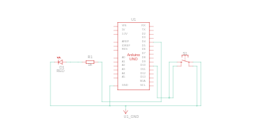

# 🔘 Push Button LED Project (Using INPUT_PULLUP)

This is a simple beginner-friendly embedded systems project using an Arduino UNO. The goal is to control an LED using a push button and the internal pull-up resistor. When the button is **pressed**, the LED turns **ON**. When released, it turns **OFF**.

---

## 🧰 Components Used

- Arduino UNO
- LED - RED colour
- 1kΩ resistor
- Push button
- Breadboard
- Jumper wires

---

## 🔌 Circuit Diagram



> **Note:** The push button is connected between the input pin and **GND**, using the Arduino’s internal pull-up resistor.

---

## 🧠 How It Works

- The push button is connected between a digital input pin-10 and **GND**.
- The pin is configured as `INPUT_PULLUP`, which keeps it at HIGH when the button is not pressed.
- When the button is **pressed**, it connects the pin to GND, making the input read **LOW**.
- The Arduino checks for this LOW signal to turn the LED ON.

---

## 📥 How to Upload the Code

1. Open the file `push_button_led.ino` in the Arduino IDE.
2. Connect your Arduino board to your PC via USB.
3. Select the correct **Board** and **Port** from the Tools menu.
4. Click **Upload** (right arrow icon).
5. Press the button and see the LED respond.

---

## ✅ Expected Output

- 🔘 Press the button → 💡 LED turns **ON**  
- 🔄 Release the button → 💡 LED turns **OFF**

---

## 💡 Sample Code

```cpp
int led = 4;
int button=10;
int buttonstate=0;
void setup()
{
  pinMode(led, OUTPUT);
  pinMode(button, INPUT_PULLUP);
}

void loop()
{
buttonstate=digitalRead(button);
  if(buttonstate==LOW){
    digitalWrite(led, HIGH);}
  else if(buttonstate==HIGH){
    digitalWrite(led, LOW);}
}
```
## 🚀 Future Improvements
- Debouncing the button
- Blink While Holding
- Using an Interrupt

## 📄 License

This project is licensed under the MIT License.
